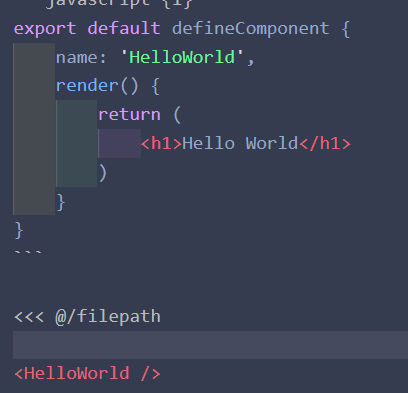

:tada: :100:

[[toc]]

::: t2
This is a tip
:::

::: warning
This is a warning
:::

::: danger
This is a dangerous warning
:::

::: danger STOP
Danger zone, do not proceed
:::

# {{ $frontmatter.title }}

1. 123123
2. 123123123

- 5848
- 89898

<script setup>
import HelloWorld from './components/HelloWorld.vue'
</script>

```javascript {1}
export default defineComponent {
    name: 'HelloWorld',
    render() {
        return (
            <h1>Hello World</h1>
        )
    }
}
```

<<< @/lib/test.js

<HelloWorld />